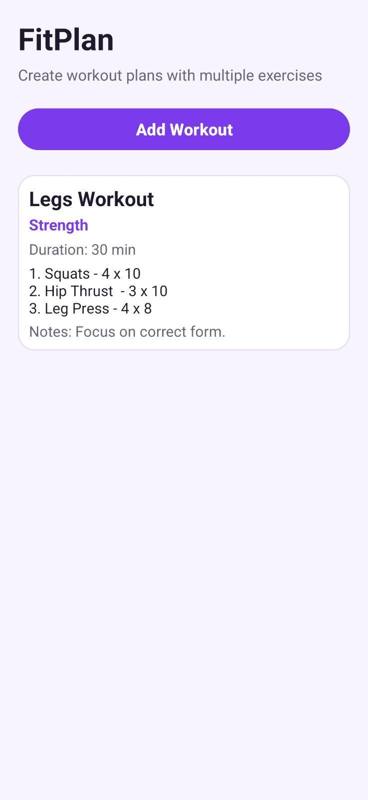
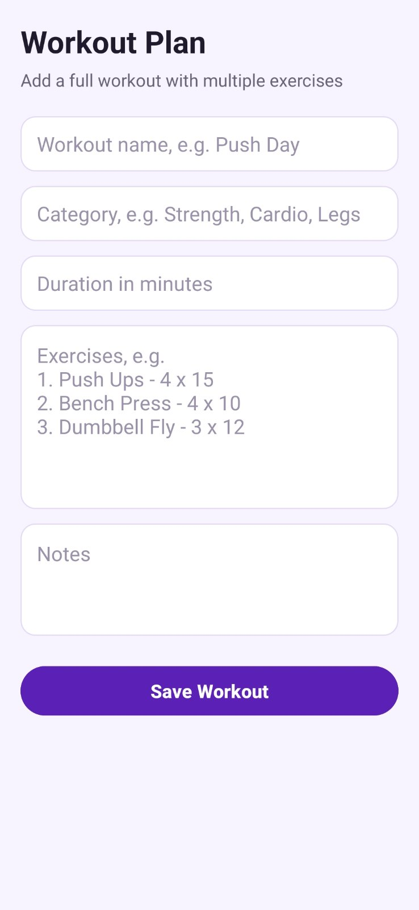
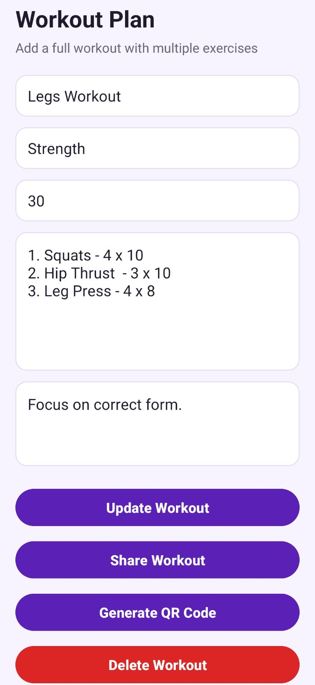
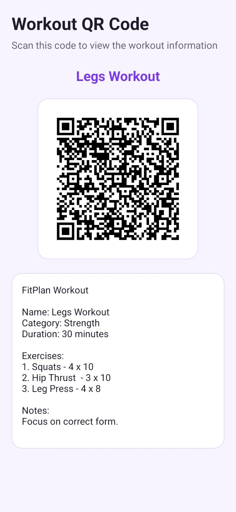
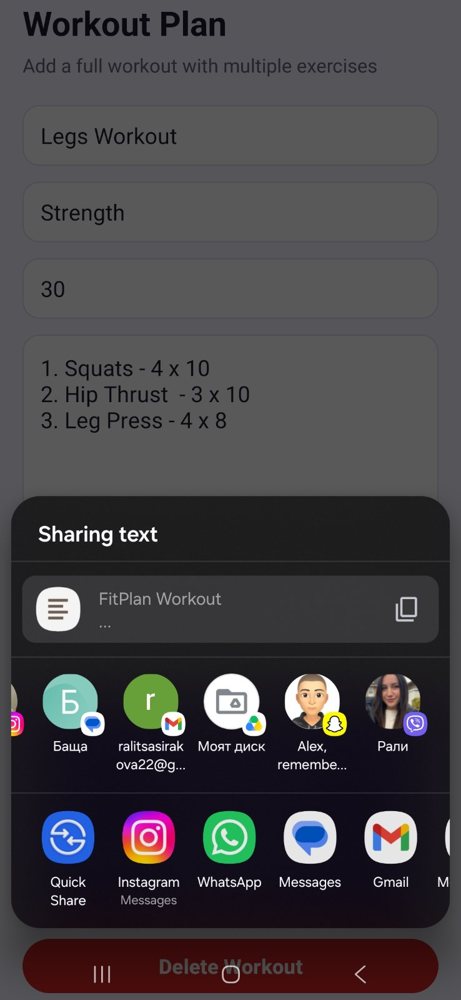

# FitPlan

FitPlan е мобилно Android приложение за създаване и управление на тренировъчни планове. Приложението позволява на потребителя да добавя цели тренировки с множество упражнения, да ги редактира, изтрива, споделя и да генерира QR код с информация за избраната тренировка.

---

## 1. Идея на приложението

Идеята на FitPlan е да даде лесен начин за записване на тренировъчни планове директно в телефона. Вместо потребителят да добавя само едно упражнение, приложението позволява създаване на цяла тренировка.

Една тренировка съдържа:

* име на тренировката;
* категория;
* продължителност в минути;
* списък с упражнения;
* бележки.

Пример:

```text
Workout name: Push Day
Category: Strength
Duration: 60 minutes

Exercises:
1. Push Ups - 4 x 15
2. Bench Press - 4 x 10
3. Shoulder Press - 3 x 12

Notes:
Focus on correct form.
```

---

## 2. Как работи приложението

При стартиране приложението показва начален екран със списък от всички запазени тренировки. Ако няма добавени тренировки, се показва съобщение, че списъкът е празен.

Потребителят може да натисне бутона **Add Workout**, за да отвори форма за създаване на нова тренировка. Във формата се попълват име, категория, продължителност, упражнения и бележки. След натискане на **Save Workout**, данните се записват в локална SQLite база данни.

След като тренировката бъде записана, тя се показва на началния екран като карта. При натискане върху карта се отваря екран за редакция. Там потребителят може да промени данните, да запази промените, да изтрие тренировката, да я сподели или да генерира QR код.

Приложението използва локална база данни, затова данните се запазват след рестарт на приложението.

---

## 3. Основни функционалности

### Добавяне на тренировка

Потребителят може да създаде нова тренировка чрез формата **Add Workout**.

### Преглед на тренировки

Всички добавени тренировки се показват на началния екран.

### Редактиране на тренировка

При натискане върху вече създадена тренировка се отваря формата за редакция. Потребителят може да промени информацията и да я запази.

### Изтриване на тренировка

В режим на редакция има бутон **Delete Workout**. Преди изтриване се показва прозорец за потвърждение.

### Споделяне на тренировка

Чрез бутона **Share Workout** потребителят може да сподели тренировката чрез други приложения, например Messenger, Viber, Gmail или други налични приложения на устройството.

### Генериране на QR код

Чрез бутона **Generate QR Code** приложението създава QR код, който съдържа информацията за избраната тренировка.

---

## 4. Архитектура

Приложението използва **MVVM архитектура** с **Repository слой**.

Основната структура е:

```text
com.example.fitplan2301681036
│
├── data
│   ├── local
│   │   └── FitPlanDatabaseHelper.kt
│   │
│   ├── model
│   │   └── Workout.kt
│   │
│   └── repository
│       └── WorkoutRepository.kt
│
├── util
│   ├── FullscreenUtils.kt
│   ├── WorkoutTextBuilder.kt
│   └── WorkoutValidator.kt
│
├── viewmodel
│   ├── WorkoutViewModel.kt
│   └── WorkoutViewModelFactory.kt
│
├── MainActivity.kt
├── AddEditWorkoutActivity.kt
└── QRCodeActivity.kt
```

### Model

`Workout.kt` описва структурата на една тренировка.

### Database Helper

`FitPlanDatabaseHelper.kt` създава и управлява SQLite базата данни. В него са реализирани операциите за добавяне, четене, редактиране и изтриване.

### Repository

`WorkoutRepository.kt` е посредник между ViewModel и SQLite базата. Activity-тата не работят директно с базата данни.

### ViewModel

`WorkoutViewModel.kt` управлява логиката за работа с тренировките. Той извиква Repository слоя и подава данните към екрана.

### Activity

Activity файловете отговарят за визуализацията и действията на потребителя.

---

## 5. Потребителски поток

Основният потребителски поток е:

1. Потребителят стартира приложението.
2. Вижда списък с добавени тренировки.
3. Натиска **Add Workout**.
4. Попълва формата за тренировка.
5. Натиска **Save Workout**.
6. Тренировката се записва в SQLite базата.
7. Тренировката се показва на началния екран.
8. При натискане върху тренировка се отваря екран за редакция.
9. Потребителят може да:

    * редактира тренировката;
    * изтрие тренировката;
    * сподели тренировката;
    * генерира QR код.

---

## 6. Използвани технологии

Проектът използва:

* Kotlin;
* Android Studio;
* SQLite;
* MVVM архитектура;
* Repository слой;
* XML layouts;
* AppCompat;
* LiveData;
* ViewModel;
* Share Intent;
* ZXing библиотека за QR код;
* JUnit за Unit тестове;
* Espresso за UI тест.

---

## 7. Локална база данни

Приложението използва SQLite база данни.

Таблицата `workouts` съдържа следните полета:

```text
id
name
category
duration_minutes
exercises
notes
created_at
```

CRUD операциите са:

* Create — добавяне на нова тренировка;
* Read — показване на всички тренировки;
* Update — редактиране на тренировка;
* Delete — изтриване на тренировка.

---

## 8. Допълнителни функционалности

### Share Intent

Приложението позволява споделяне на тренировъчен план чрез стандартния Android Share Intent.

### QR Code

Приложението може да генерира QR код за избрана тренировка. QR кодът съдържа текстова информация за тренировъчния план.

---

## 9. Тестове

Проектът съдържа Unit тестове и UI тест.

### Unit tests

Unit тестовете проверяват:

* дали валидни данни за тренировка се приемат;
* дали празни полета се отхвърлят;
* дали грешна продължителност се отхвърля;
* дали текстът за Share и QR се генерира правилно.

Файлове:

```text
WorkoutValidatorTest.kt
WorkoutTextBuilderTest.kt
```

### UI test

UI тестът проверява основния потребителски сценарий:

1. отваряне на приложението;
2. натискане на **Add Workout**;
3. попълване на форма;
4. записване на тренировка;
5. проверка дали тренировката се показва в списъка.

Файл:

```text
MainActivityUiTest.kt
```

---

## 10. Стъпки за стартиране

1. Отворете проекта в Android Studio.
2. Изчакайте Gradle Sync да приключи.
3. Стартирайте приложението на емулатор или физическо Android устройство.
4. Натиснете **Add Workout**.
5. Създайте примерна тренировка.
6. Проверете дали тренировката се показва на началния екран.

---

## 11. Тестови акаунти

Приложението не използва регистрация и вход с потребителски акаунти.

Всички данни се съхраняват локално чрез SQLite база данни на устройството.

---

## 12. Скрийншотове

### Начален екран


### Добавяне на тренировка


### Редактиране на тренировка


### QR код


### Споделяне на тренировка


---

## 13. APK файл

Готовият APK файл се намира в папка:

```text
/apk/app-release.apk
```

APK файлът може да бъде инсталиран на Android устройство с Min SDK 24 или по-нова версия.

---

## 14. Автор

Име: Ралица Сиракова
Факултетен номер: 2301681036
Дисциплина: ППМУ

---

## 15. Обобщение

FitPlan е Android приложение за управление на тренировъчни планове. Проектът покрива основните изисквания по дисциплината чрез Kotlin, локална SQLite база данни, пълен CRUD, MVVM архитектура с Repository слой, Unit тестове, UI тест, Share Intent и QR Code функционалност.
